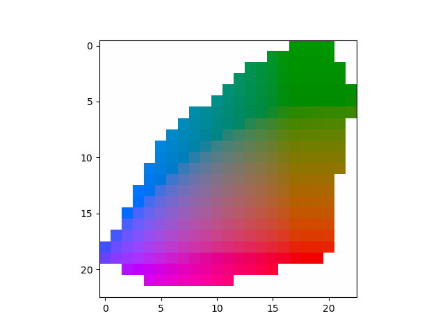

# Colorful Image Colorization (Zhang et al, 2016)

This repository contains a PyTorch implementation of the [Colorful Image Colorization](https://arxiv.org/pdf/1603.08511.pdf) paper by Zhang et Al, 2016.

Some changes were made, namely:
- As no clear instructions are given on how to get the 313 colour bins, these were calculated by myself as closely as possible. I ended up with 326 colours. 
    - See [this discussion](https://github.com/richzhang/colorization/issues/23) on the original repository for more details or [this project](https://github.com/Riretta/LabSpace_YCbCrSpace) for alternatives
- I changed the network architecture to accommodate 326 different classes instead of the original 313.
- The script provided trains on the STL10 dataset, as I don't have the hardware to work on ImageNET.

## Implementation Details

### Color Quantization

The discretization is made by iterating through each RGB combination and converting it to LAB space. This, however, leaves us with ~260 colours, far fewer than the original 313.

However, by accounting for the soft encoding mechanism described in the original paper, we can find the missing colours. For each colour in the gamut, instead of simply taking the closest AB bin, we take the 5 closest ones. This leaves us with the final 326 colours.

The image below shows the colour bins for L=50.



### Neural Network Architecture

For the NN, I simply followed the [original repo's description](https://github.com/richzhang/colorization/blob/caffe/colorization/models/colorization_deploy_v1.prototxt) of it, as the paper didn't provide enough details. I made no changes except the final number of classes.

### Class Rebalancing

For the class rebalancing, I started by obtaining the probability distribution of the colours. To do this, I simply iterated through the entire training set and normalized the sum of the count of each colour.

In order to obtain the weights, I followed the equation 4 of the original paper: $((1 - \lambda) \widetilde{p} + \frac{\lambda}{Q})^{-1}$. Then, I changed the weights so that $\sum_q \widetilde{p}_q w_q = 1$, by using the following set of equations:

$$ pw = \widetilde{p}*w$$
$$ S = \mathbb{E}[pw]$$
$$ w = \frac w S$$

### Annealed Mean

To calculate the annealed mean, it suffices to follow equation 5 of the article.

## How to run

### Requirements

I recommend using a [Mamba](https://mamba.readthedocs.io/en/latest/mamba-installation.html) environment. After installing Mamba, you can get up to speed with the following:
```
$ mamba create -n colorful
$ mamba activate colorful
$ pip install -r requirements.txt
```

For training (assuming CUDA GPU 0):
```
$ python -m src --gpu 0
```

For generating the gamut hull:
```
$ python -m src.hull
```

For generating the probability distribution and associated weights:
```

$ python -m src.prob
```

For testing a model on a given example
```
$ python -m src.test --model /path/to/model.pth
```
